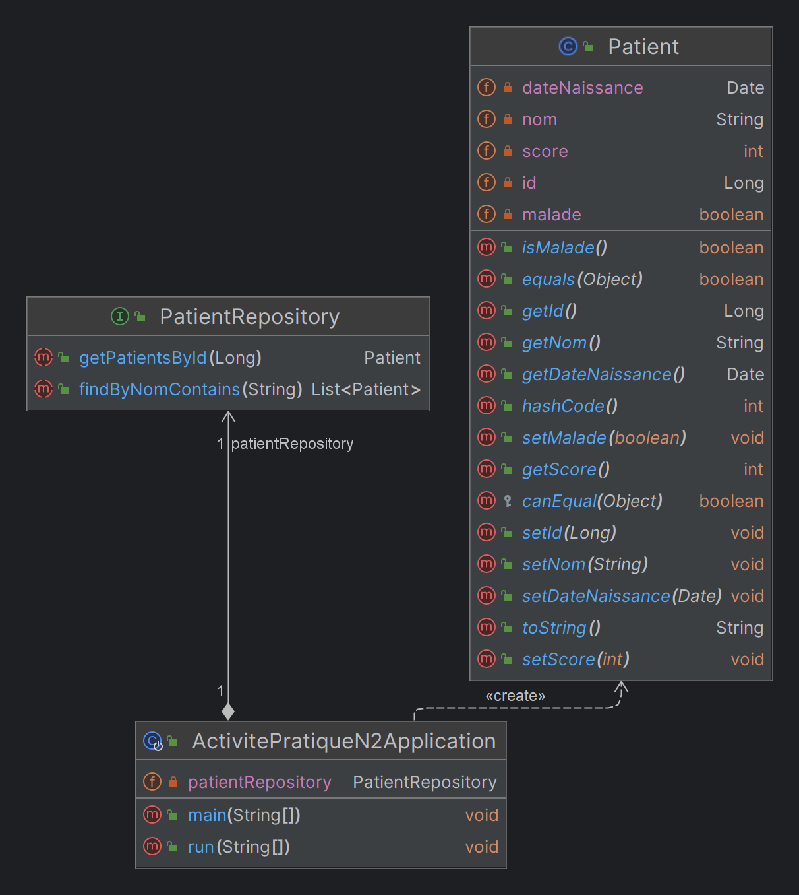

# Gestion des Patients avec Java Spring 🏥

Ce projet Java Spring est une application de gestion des patients, développée dans le cadre de `Activité Pratique N°2 - ORM, JPA Hibernate Spring Data`. Il utilise Spring Boot et JPA pour fournir un système permettant de gérer les informations des patients.

## Fonctionnalités

- **Ajout de patients** : Ajouter de nouveaux patients à la base de données.
- **Consultation de tous les patients** : Afficher tous les patients enregistrés.
- **Consultation d'un patient** : Afficher les détails d'un patient spécifique.
- **Recherche de patients par nom** : Rechercher les patients dont le nom contient une lettre spécifique.
- **Mise à jour des informations d'un patient** : Mettre à jour les informations d'un patient existant.
- **Suppression d'un patient** : Supprimer un patient de la base de données.

## Structure du Projet

- **Entities** : Contient la classe `Patient` qui définit l'entité JPA pour représenter les patients.
- **Repository** : Contient l'interface `PatientRepository` qui étend `JpaRepository` pour effectuer des opérations CRUD sur les patients.
- **Main Application** : Classe principale `ActivitePratiqueN2Application` qui lance l'application Spring Boot et implémente `CommandLineRunner` pour exécuter les opérations lors du démarrage.

## UML


## Technologies Utilisées

- **Java Spring Boot** : Framework Java pour le développement d'applications.
- **JPA (Java Persistence API)** : Interface de programmation Java permettant de gérer les données relationnelles.
- **Hibernate** : Framework de mapping objet-relationnel pour Java.
- **Lombok** : Bibliothèque Java qui automatise la génération de code répétitif, comme les accesseurs et les mutateurs.
- **MySQL** : Système de gestion de base de données relationnelle.
- **H2** : Base de données en mémoire, alternative à MySQL pour les tests et le développement.

## Configuration

Le fichier `application.properties` contient la configuration de l'application, y compris les détails de la base de données. Assurez-vous de configurer correctement les informations de votre base de données MySQL.

```properties
server.port=3309
spring.datasource.url=jdbc:mysql://localhost:3306/patientsdb?createDatabaseIfNotExist=true
spring.datasource.username=root
spring.datasource.password=
spring.jpa.hibernate.ddl-auto=update
```
### Utilisation de H2

Décommentez les lignes suivantes pour utiliser H2 :

```properties
# Utilisation de H2 (base de données en mémoire)
#spring.datasource.url=jdbc:h2:mem:patientsdb
#spring.datasource.username=sa
#spring.datasource.password=
#spring.h2.console.enabled=true
```


## Exécution

Pour exécuter l'application, assurez-vous d'avoir configuré une base de données MySQL avec les informations spécifiées dans `application.properties`. Ensuite, exécutez la classe principale `ActivitePratiqueN2Application`.


## Auteur

Ce projet a été développé par **HAMZA DAMIRI (Dev7HD)** - [GitHub Profile](https://github.com/Dev7HD).

---

**Note :** Assurez-vous d'avoir les dépendances et l'environnement nécessaire configurés correctement avant d'exécuter l'application.