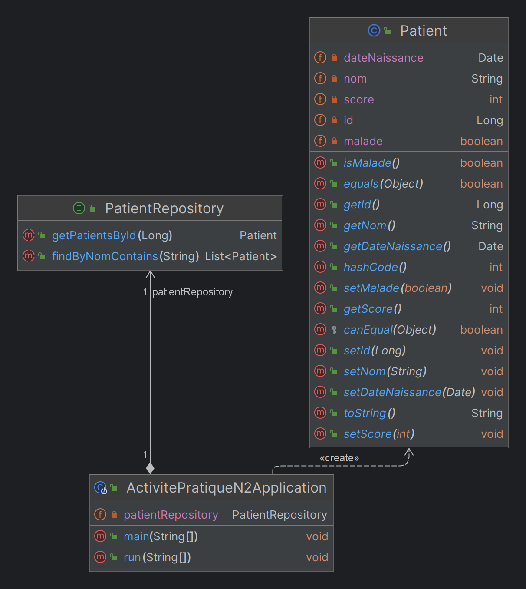

# Gestion des Patients avec Java Spring 🏥

## Definition et Technologies Utilisées

- **Spring Data**: Spring Data fait partie du framework Spring, qui est un ensemble complet d'outils pour le développement d'applications Java,Spring Data simplifie le développement des couches d'accès aux données en fournissant un modèle de programmation unifié et cohérent pour différents types de stockage de données, tels que les bases de données relationnelles, les bases de données NoSQL, etc.Il offre un support pour diverses technologies d'accès aux données, notamment JPA, JDBC MongoDB, Cassandra, et d'autres.

- **JPA (Java Persistence API)**: JPA est une spécification Java pour la gestion des données relationnelles dans les applications Java. Elle propose une méthode standardisée pour que les développeurs Java interagissent avec des bases de données relationnelles en utilisant des approches orientées objet. JPA définit un ensemble d'interfaces et d'annotations permettant aux développeurs de mapper des objets Java sur des tables de base de données, d'effectuer des opérations CRUD (Create, Read, Update, Delete) et de interroger les données à l'aide d'une API orientée objet.

- **Hibernate**: Hibernate est une implémentation populaire et open-source de la spécification JPA. Il s'agit d'un framework ORM qui simplifie l'interaction avec les bases de données dans les applications Java en fournissant un mappage puissant, haute performance et flexible entre les objets Java et les tables de base de données. Hibernate se charge de traduire les objets Java en requêtes SQL et vice versa, permettant aux développeurs de travailler avec des objets dans leur code tout en persistant et récupérant des données dans une base de données relationnelle.

- **ORM (Object-Relational Mapping)** : L'ORM est une technique de programmation qui permet la conversion de données entre des systèmes de types incompatibles, tels que entre une base de données relationnelle et un langage de programmation orienté objet. Dans le contexte de Java, les frameworks ORM comme Hibernate fournissent un moyen de mapper des objets Java sur des tables de base de données et vice versa, éliminant la nécessité pour les développeurs d'écrire des requêtes SQL de bas niveau. L'ORM simplifie les interactions avec la base de données, améliore la maintenabilité du code et augmente la productivité en permettant aux développeurs de travailler avec des objets dans leur langage de programmation plutôt que de traiter directement avec des détails spécifiques à la base de données.

- **Lombok** :
  Lombok est une bibliothèque Java qui simplifie le développement en automatisant la génération de code répétitif.
  Elle introduit des annotations spéciales dans le code Java pour générer automatiquement les méthodes telles que les getters, les setters, les constructeurs, et d'autres méthodes couramment utilisées.
  L'utilisation de Lombok peut réduire la quantité de code boilerplate (code redondant) que les développeurs doivent écrire, améliorant ainsi la lisibilité du code et accélérant le processus de développement.

- **H2 Database** :
  H2 est une base de données relationnelle légère écrite en Java.
  Elle est souvent utilisée comme base de données embarquée dans des applications Java, ce qui signifie qu'elle peut être intégrée directement dans une application et fonctionner en mémoire ou être stockée sur le disque sans nécessiter un serveur de base de données distinct.
  H2 prend en charge le mode embarqué, le mode serveur, et peut également fonctionner en mode mémoire pour les tests.
- **MySQL** :
  MySQL est un système de gestion de base de données relationnelle (SGBDR) open-source.
  Il est largement utilisé dans le développement web pour stocker et gérer les données.
  MySQL prend en charge le langage SQL (Structured Query Language) pour interagir avec la base de données, et il offre une performance élevée, une fiabilité et une flexibilité qui en font l'un des systèmes de gestion de base de données les plus populaires au monde.

    <p>En résumé, Spring Data est un framework d'accès aux données de haut niveau qui prend en charge divers types de stockage de données, tandis que JPA est une norme permettant aux développeurs Java d'interagir avec des bases de données relationnelles. Hibernate, une implémentation spécifique de JPA, agit comme un framework ORM puissant pour les applications Java. Ensemble, ils offrent une méthode robuste et normalisée pour gérer la persistance des données dans les applications d'entreprise Java. D'autre part, Lombok simplifie le développement en automatisant la génération de code, tandis que H2 Database est souvent utilisé comme une base de données relationnelle légère embarquée, offrant une alternative pratique pour le stockage des données. Enfin, MySQL, un système de gestion de base de données relationnelle open-source répandu, fournit des fonctionnalités essentielles pour le stockage et la gestion des données dans le développement d'applications Java. Chacun de ces outils joue un rôle spécifique dans le processus de développement d'applications Java, simplifiant certaines tâches et fournissant des fonctionnalités essentielles pour la gestion des données.</p>

## presentations

"Gestion des Patients" révèle qu'il s'agit d'une application Java Spring créée spécifiquement pour répondre aux exigences de `l'Activité Pratique N°2 axée sur les concepts d'ORM, JPA, Hibernate et Spring Data`. Le projet est construit sur la base du framework Spring Boot et utilise la technologie JPA pour faciliter l'interaction avec la base de données. Son objectif principal est de fournir un système complet de gestion des informations des patients. Grâce à l'utilisation de Spring Boot, le projet bénéficie de la simplicité de configuration et de démarrage rapide, tandis que l'intégration de JPA et Hibernate garantit une gestion efficace des objets Java et de leur persistance dans la base de données. En somme, ce projet offre une solution robuste pour la gestion des patients, exploitant les meilleures pratiques de développement d'applications Java modernes et les technologies ORM associées pour assurer une expérience de programmation efficace et une gestion optimale des données.

## Fonctionnalités

- Le projet "Gestion des Patients" a été conçu avec les fonctionnalités suivantes pour répondre de manière complète et efficace aux besoins de gestion des informations des patients :

- Le projet "Gestion des Patients" a été conçu avec les fonctionnalités suivantes pour répondre de manière complète et efficace aux besoins de gestion des informations des patients :

- **Ajout de patients** : Cette fonctionnalité permet à l'utilisateur d'ajouter de nouveaux patients à la base de données. Elle facilite l'enregistrement rapide et précis des informations d'un nouveau patient.

- **Consultation de tous les patients** : Cette fonctionnalité offre la possibilité d'afficher la liste complète de tous les patients enregistrés dans la base de données. Elle permet une vue d'ensemble rapide de l'ensemble des informations des patients.

- **Consultation d'un patient** : L'utilisateur peut accéder à des détails spécifiques d'un patient en sélectionnant cette fonctionnalité. Cela inclut une vue détaillée des informations personnelles, médicales et autres détails pertinents pour un suivi précis.

- **Recherche de patients par nom** : Pour faciliter la recherche et l'accès à des informations spécifiques, cette fonctionnalité permet de rechercher des patients en fonction de leur nom. Elle contribue à une gestion plus efficace des dossiers patients.

- **Mise à jour des informations d'un patient** : En cas de changement dans les informations d'un patient, cette fonctionnalité offre la possibilité de mettre à jour les données existantes. Cela garantit que les enregistrements restent à jour et précis.

- **Suppression d'un patient** : Pour la gestion des données et afin de maintenir une base de données propre, cette fonctionnalité permet de supprimer un patient enregistré. Cela peut être utile en cas de doublon, d'erreur d'enregistrement ou pour des raisons administratives.

## UML



## Configuration

Le fichier `application.properties` contient la configuration de l'application, y compris les détails de la base de données. Assurez-vous de configurer correctement les informations de votre base de données MySQL.

```properties
server.port=3309
spring.datasource.url=jdbc:mysql://localhost:3306/patientsdb?createDatabaseIfNotExist=true
spring.datasource.username=root
spring.datasource.password=
spring.jpa.hibernate.ddl-auto=update
```

### Utilisation de H2

Décommentez les lignes suivantes pour utiliser H2 :

```properties
# Utilisation de H2 (base de données en mémoire)
#spring.datasource.url=jdbc:h2:mem:patientsdb
#spring.datasource.username=sa
#spring.datasource.password=
#spring.h2.console.enabled=true
```
